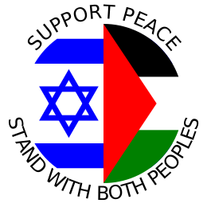

# Support Peace in Palenstine-Israel - Stand with Both Peoples

| SVG |  |  |   |
|--|--|--|--|
| PNG |  |  |   |

## Why?

There are two peoples in Palestine/Israel. Any solution to the conflict must first acknowledge this very basic fact.

Both peoples believe they are fighting for their very survival. If you only wave the flag of one people, you reinforce the other people’s belief that no-one will come to its aid if it loses the fight. This can only lead to further disregard for the humanity of the other and to further atrocities.

We live in a world of eco-chambers, and it is much easier to accept the narrative of either one of the peoples. Holding both conflicting perspectives is a constant painful struggle. But only by advocating for the well-being of both peoples we are supporting peace, and without peace, no-one in that troubled piece of land is safe.

This is what I hoped to convey in the graphics above.

## What can you do?

Please download the graphic, print it, share it. The QR leads back to this web-page, share it as a means for spreading the message.

There are various online service that would print on button badges, stickers, etc. Here’s one: [BananaPrint](https://www.banana-print.co.uk/button-badges/).

If you’re in the UK and need a few badges, I’d be happy to mail them to you. Feel free to contact me for that or for anything else:

<iframe src="https://docs.google.com/forms/d/e/1FAIpQLSeYX5rmX3K-P-uDJJELuiWgha62kJdZhr7Fd6J9S8D9omRJmQ/viewform?embedded=true" width="640" height="1031" frameborder="0" marginheight="0" marginwidth="0">Loading…</iframe>

As you can see, I am not a web designer.  Advice is welcome.

## Who am I?

There is no organization behind this web page, just me, Elon Portugaly.

I do not plan to create an organization, but if some organization would like to take on this effort, I will gladly cooperate.
